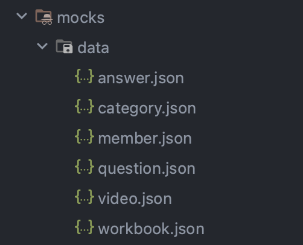
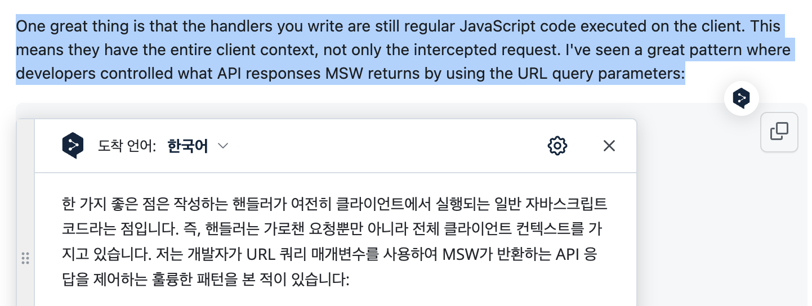
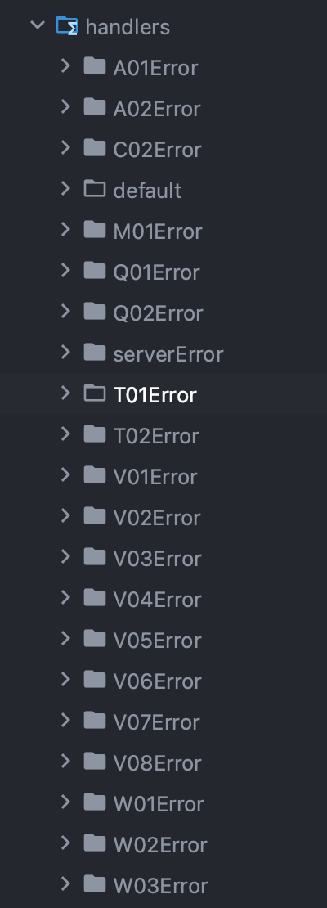
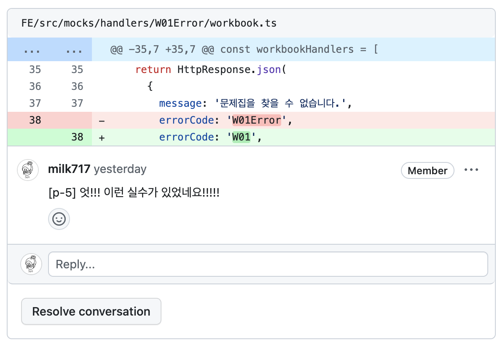

곰터뷰 프로젝트에서는 서버의 개발속도에 제약을 받지 않고 페이지 개발을 진행하기 위해 MSW를 사용하고 있는데요. MSW(Mock Service Worker)란 서비스 워커 API를 사용해 실제 네트워크 요청을 가로채고, 미리 정의된 응답을 반환해 백엔드 서버 없이도 HTTP 요청을 모방할 수 있게 해주는 라이브러리입니다.
곰터뷰 프론트엔드는 MSW 덕분에 백엔드 API 배포 속도에 영향을 받지 않고 프론트엔드 개발을 빠르게 진행할 수 있었습니다. 이번 글에서는 우리팀이 MSW를 어떻게 활용해서 빠르게 개발을 진행할 수 있었는지에 대해 다뤄보겠습니다.
# MSW 빠르게 목업하기
MSW를 사용하는 주된 이유 중 하나는 백엔드의 영향을 받지 않고 프론트엔드의 개발을 진행하기 위함입니다.
하지만 MSW를 목업하는데 많은 시간이 소요된다면 빠른 개발을 위해 도입했던 MSW가 어느새 골치아픈 태스크가 돼버리죠. 따라서 우리 팀은 최소한의 비용으로 응답을 목업하기 위해 다음과 같은 방법을 사용했습니다.
## response body를 위한 json 더미데이터 생성
서버에 요청을 보냈을 때 response 응답에 대한 데이터를 한 곳에서 편리하게 관리하기 위해 모든 response 응답을 json 파일 형식으로 만들어서 관리했습니다. 각 json 파일은 데이터베이스의 테이블을 기준으로 분리했습니다.

MSW 핸들러에서 바로 객체를 생성해 응답을 내려주지 않고 별도의 json으로 관리한 이유는 추후 에러 상황에 대한 핸들러들이 추가되었을 때도 일관된 데이터를 사용하기 위함입니다. 이 부분은 아래 에러응답에 목업에 대해 설명할 때 더 자세히 언급하도록 할게요.
## 클라이언트의 응답을 검증하지 않고 성공 응답을 내려줌
```ts
http.post(API.ANSWER, () => {  
  return HttpResponse.json({}, { status: 201 });  
}),  
http.post(API.ANSWER_DEFAULT, ({ request }) => {  
  return HttpResponse.json({}, { status: 201 });  
}),
```
POST, PATCH등 클라이언트의 request body에 따라서 다른 응답을 내려줘야 하는 요청의 경우, 사용자가 보낸 응답을 검증하지 않고 무조건 성공 응답을 내려줬습니다. 왜냐하면 응답 검증 로직이 추가되는 순간 MSW를 목업하는데 굉장히 많은 시간이 소요되기 때문인데요. 
MSW가 책임져야 할 것은 백엔드 API가 배포되기 전 클라이언트에서 API 연결 환경을 구성하기 용이하게 해주는 것이지 실제 동작을 제공할 필요는 없습니다.
따라서 request body를 검증하지 않고 무조건 성공 응답을 내려주도록 목업을 구현했습니다.
## json 데이터로 response body 생성
```ts
http.get(API.ANSWER_ID(), ({ params }) => {  
  const { id: answerId } = params;  
  const answerIdMap = new Map<number, AnswerEntity[]>();  
  answerData.forEach((answer) => {  
    answerIdMap.has(answer.answerId)  
      ? answerIdMap.get(answer.answerId)!.push(answer)  
      : answerIdMap.set(answer.answerId, [answer]);  
  });  
  return HttpResponse.json(answerIdMap.get(Number(answerId)));  
}),
```
GET 요청처럼 response body가 필요한 응답의 경우 위에서 저장해놨던 json 더미데이터를 불러와 응답을 생성하는 로직을 작성했습니다. GET요청같은 경우 서버에서 내려주는 데이터가 어느정도 있어야 API 응답에 따른 화면을 구성할 수 있기 때문인데요. 이 또한 많은 시간이 소요되지 않도록 json 데이터만 간단하게 가공해서 응답을 생성했습니다.
# 에러 응답 목업하기
위와 같은 방법을 사용하니 API 성공 케이스에 대해서 최소한의 시간만을 들여 API 목업을 완료할 수 있었습니다.
하지만 클라이언트에서 다양한 케이스에 대한 API를 테스트하기 위해서는 성공 뿐만 아니라 에러 케이스에 대한 목업도 필요합니다.

에러 응답에 대한 목업은 MSW 핸들러 응답의 http status 코드만 에러코드로 수정해주면 되기 때문에 아주 간단한 작업입니다. 하지만 문제는 언제 에러를 발생시킬 것인지에 대한 조건을 설정하는 것인데요.
어떻게 하면 에러 케이스를 테스트할 수 있을지에 대해 고민하며 아래와 같은 방법들을 고려해봤습니다.
### 방법1: 클라이언트의 request body에 따라 다른 에러 케이스를 내려준다
하지만 이 방법을 사용하면, 클라이언트의 요청을 분석하고 검증해서 에러 상황을 발생시켜야 합니다.
이는 백엔드 코드 중 컨트롤러에 해당하는 코드로 이 작업을 처리하려면 MSW로 얻을 수 있는 이점보다 더 많은 비용이 소요된다고 판단했습니다. 
### 방법2: 클라이언트의 api 요청 주소에 따라 다른 에러 케이스를 내려준다
정상적인 응답을 내려주는 api 요청 주소가 `api/user` 라고 가정했을 때 `api/user/error` 라는 주소로 요청을 보내면 에러 응답을 반환하는 방법에 대해 고민해봤습니다. 
request body를 검증해야 하는 방법1보단 적은 시간이 소요되겠지만, 클라이언트 코드에서 api 요청 엔드포인트를 변경해야 한다는 수고로움이 있습니다.
'api 에러 케이스를 테스트하기 위해 클라이언트 코드를 수정하는 것이 과연 옳은 시나리오일까?'에 대해 고민해본 결과 뭔가 이상한 방법이라고 생각했죠. 귀찮은걸 극도로 싫어하는 개발자들이 이렇게 불편하게 MSW를 사용할 것 같진 않다는 예감이 들었습니다.
## 우리가 채택한 방법
위의 두 가지 방법 모두 똑똑한 해결책은 아니라고 판단했고, 더 나은 방법을 찾기 위해 탐색해본 결과 아래와 같은 글을 찾을 수 있었습니다.
[How do you mock different responses in real life? #1117](https://github.com/mswjs/msw/discussions/1117)

이 글의 작성자도 저와 동일한 고민을 하고 있었는데요. 런타임 환경에서 실시간으로 MSW의 핸들러 응답을 교체하는 방법에 대해 고민하고 있었습니다. 그리고 이 글의 답변에서 아주 획기적인 해결책을 발견했습니다!!

```ts
export const handlers = [
  rest.get('/api/articles/latest', (request, response, context) => {
    const pageParams = new URLSearchParams(window.location.search)
    const scenario = pageParams.get('scenario')

    // Sad path
    if (scenario === 'error') {
      return response(
        context.status(500),
        context.json({ error: 'oops!' }),
      )
    }

    // Happy path
    return response(
      context.status(200),
      context.json({ data: 'some-random-fake-data' }),
    )
  }),
```

즉, 요약하자면 MSW 또한 클라이언트 코드 위에서 실행되기 때문에 클라이언트의 url 쿼리 스트링 주소를 가져올 수 있다는 것인데요. 이에 따라 MSW 핸들러 코드를 다르게 설정하면 클라이언트의 코드 변경 없이 상황별 API 응답을 받을 수 있습니다.
## 곰터뷰에서는 이 방법을 어떻게 적용했을까?
곰터뷰 서비스는 디테일한 에러 핸들링을 위해 http status 코드 뿐 아니라 커스텀 에러코드를 정의해서 사용하고 있는데요. 이 모든 에러 상황을 하나의 핸들러 코드 안에서 쿼리 파라미터에 따라 분기처리를 하는 것은 핸들러의 가독성을 저하시키고, 불편한 방법이라고 생각했습니다.

그래서 공식문서를 좀 찾아봤더니 [Network behavior overrides - Mock Service Worker](https://mswjs.io/docs/best-practices/network-behavior-overrides)라는 글을 발견했습니다. 이 글의 설명을 요약하자면, `setupWorker`로 핸들러를 설정하고, `worker.use` 문법을 사용해 동적으로 핸들러를 교체할 수 있다는 것입니다. 그래서 이를 적용해 다음과 같이 MSW browser의 진입점을 설정할 수 있었습니다.
### 클라이언트의 url 주소에 따른 핸들러 교체
```ts
const isScenarioName = (str: string): str is keyof typeof scenarios => {  
  return str in scenarios;  
};  
  
const scenarioName =  
  new URLSearchParams(window.location.search).get('error') || 'default';  
export const worker = setupWorker();  
  
isScenarioName(scenarioName)  
  ? worker.use(...scenarios[scenarioName])  
  : worker.use(...scenarios.default);
```
- `isScenarioName` 함수는 타입 가드를 위한 함수입니다.
- `scenarioName`에서 클라이언트의 url 쿼리 값을 가져옵니다.
- `setupWorker`로 MSW를 초기화 한 후
- `worker.use(...scenarios[scenarioName])`으로 클라이언트 url 쿼리 스트링에 따른 MSW 핸들러 집합을 설정해줍니다.
### 상황별 핸들러
```tsx
export const scenarios = {  
  default: defaultHandlers,  
  a01: A01ErrorHandlers,  
  a02: A02ErrorHandlers,  
  c02: C02ErrorHandlers,  
  m01: M01ErrorHandlers,  
  q01: Q01ErrorHandlers,  
  q02: Q02ErrorHandlers,  
  server: serverErrorHandlers,  
  t01: T01ErrorHandlers,  
  t02: T02ErrorHandlers,  
  v01: V01ErrorHandlers,  
  v02: V02ErrorHandlers,  
  v03: V03ErrorHandlers,  
  v04: V04ErrorHandlers,  
  v05: V05ErrorHandlers,  
  v06: V06ErrorHandlers,  
  v07: V07ErrorHandlers,  
  v08: V08ErrorHandlers,  
  w01: W01ErrorHandlers,  
  w02: W02ErrorHandlers,  
  w03: W03ErrorHandlers,  
};
```
클라이언트의 쿼리 스트링으로 입력받은 값은 각 커스텀 에러 코드에 해당하는 핸들러 집합에 대응됩니다.

각 에러 핸들러 집합 내부에는 성공 핸들러 응답과 로직은 동일하지만 `T01` 에러에 해당하는 케이스들은 `T01`에러가 발생하는 응답이 내려옵니다.
## ✨결과✨

`error=default`로 설정되어 있을 때는 정상적인 api 응답이 내려오고, 이 쿼리스트링을 `error=t01`로 교체하는 순간 MSW 핸들러 집합이 T01ErrorHandlers로 변경되어 에러 상황에 대한 api 응답이 내려오는 것을 볼 수 있습니다.
# 후기
'역시 개발자들이 불편함을 감수할 리가 없어!'라는 생각이 절로 들게 하는 해결책이었는데요.
쿼리를 통해 핸들러를 교체한다는 것이 너무 충격적이게 획기적이고 편리한 방법이라 꼭 모두에게 널리 공유하고 싶었습니다.

하지만 여전히 불편함은 살짝 남아있는데요. 바로 수많은 에러 상황에 대한 핸들러 집합을 모두 작성해야 한다는 점 입니다.

저 모든 핸들러를 작성하는 단순 반복 작업을 진행하는 것이 참 아까운 시간이라는 생각이 들었습니다.
이전에 멘토님께 MSW에 관한 질문을 했을 때 [plop - npm](https://www.npmjs.com/package/plop)이라는 패키지를 추천받았습니다.
그 때는 MSW의 이런 사용법을 몰라서 도대체 어떻게 도입해야 하는거지? 하는 의문이 있었는데요.
이제서야 저 패키지의 필요성을 느끼게 된 것 같습니다.
실제로 이 작업을 진행하면서 아래와 같은 실수가 발생하기도 했습니다.😂😂

다음번 MSW를 수정 작업을 할 때는 plop를 사용해서 더 똑똑하게 목업을 해본 후 유용한 팁을 공유해보도록 하겠습니다~

>[!info]
>이 게시글에 나온 방법과 다른 방법으로 MSW를 목업하신 분이 있다면 꼭 공유 부탁드립니다 ㅎㅎ

# 참고 링크
[How do you mock different responses in real life? #1117](https://github.com/mswjs/msw/discussions/1117)
[Network behavior overrides - Mock Service Worker](https://mswjs.io/docs/best-practices/network-behavior-overrides)
#### 관련 PR
[[NDD-344] MSW 에러 모킹하기, 더미데이터 json으로 변경 (2h/3h)](https://github.com/boostcampwm2023/web14-gomterview/pull/169)
